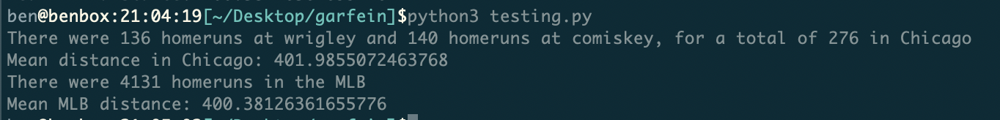
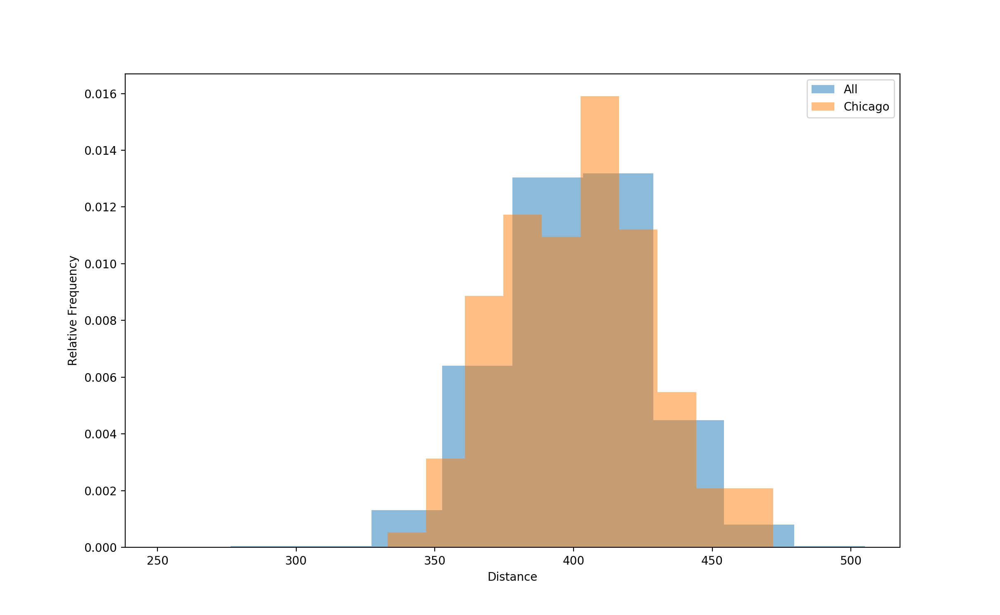

# Baseball distance comparison

## What is this?

I saw a tweet from Chuck Garfein [here](https://twitter.com/ChuckGarfien/status/1154546316153970688) (follow him if you're not already) which read:

"Nelson Cruz just hit the baseball on the left field concourse.   Ball has been jumping off his bat this year, especially here in Chicago." 

I was intrigued by this. I wanted to know whether there really was a significant difference between homerun distances this year in Chicago and anywhere else. I decided that the tool appropriate was probably the Kolmogorov-Smirnov test, a statistical test used to determine whether there's a "significant" difference between two distributions. This code will help answer that question.

## Data source

I exported the data from (Baseball Savant)[https://baseballsavant.mlb.com/statcast_search?hfPT=&hfAB=home%5C.%5C.run%7C&hfBBT=&hfPR=hit%5C.%5C.into%5C.%5C.play%5C.%5C.score%7C&hfZ=&stadium=17&hfBBL=&hfNewZones=&hfGT=R%7C&hfC=&hfSea=2019%7C&hfSit=&player_type=batter&hfOuts=&opponent=&pitcher_throws=&batter_stands=&hfSA=&game_date_gt=&game_date_lt=&hfInfield=&team=&position=&hfOutfield=&hfRO=&home_road=&hfFlag=&hfPull=&metric_1=&hfInn=&min_pitches=0&min_results=0&group_by=name&sort_col=pitches&player_event_sort=h_launch_speed&sort_order=desc&min_pas=0#results]. I asked for all homeruns, then all homeruns at The Cell (I call it 'downward arrow park' after the rebrand), then finally all homeruns from Wrigley Field.

## Results

I computed the mean distances of homeruns in chicago versus elswhere, and found no major differences. Here are the results: . Players in Chicago hit the ball 401 ft on homeruns as compared to the mlb-wide 400 ft.

Then, I made a relative-frequency histogram to visually compare. The distributions look pretty similar. Here's the graph: 

Finally, I did a KS test to check if the two distributions were statistically significantly different. The usual standard for tests like this is P<=.05. In this case, the null hypothesis is that the distributions are not different. With a P-value of p=0.8889765283383031, we fail to reject the null hypothesis and the distributions are not statistically significantly different.

## Addendum

I will probably test between 2018 and 2019 as well. Will add a note here when I do that. 